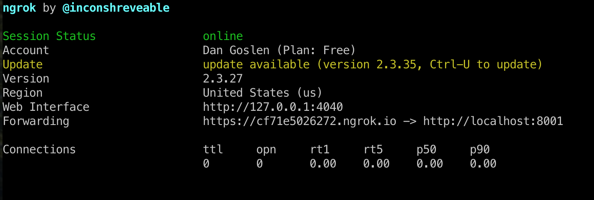

# How to add the classroom bot to your workspace?

With our current way of things our slackbot is not distributed and hence not every workspace can automatically search for our bot and add it to their workspace.

This guide is provided to help you build out new commands or debug issues with existing ones. You will need

* A Slack workspace. Consider creating a personal one for free or utilize an existing one. If you utilize an existing one, you might need to name your app slightly different to deal with name collisions.
* A tunneling service such as [Ngrok](https://ngrok.com/) (see below) to expose locally running services on your computer.
* All services running on your computer. See the [running the proxy](../README.md#running-the-proxy-service)

#### Recieving Slack Commands

For local development/debugging, you will also need to create a [reverse proxy](https://en.wikipedia.org/wiki/Reverse_proxy) to expose your local service to the internet to recieve the slack commands. [Ngrok](https://ngrok.com/) is a popular reverse proxy that you can use for free.

Once you have installed `ngrok`, if you run this command, you will be given a URL for which to use as your reverse proxy to your locally running bot-proxy-server
```
ngrok http -inspect=false -bind-tls=true 8001
```

This will output a screen that looks like the image below



Take note of the "Forwarding URL" as you will need it as you setup the app. We will refer to this URL as `Ngrok-URL` in the rest of the instructions.

This will create a tunnel that exposes the service running on port 8001 on your local machine to the interent.

**NOTE: unless you have a paid plan, this URL will change! You will need to update it whenever you restart your tunnel**

## Exposing Your Proxy Service For Development

During development, you will need to expose 

## Registering Your Bot for Development

1. Goto this [link](https://api.slack.com/).
2. On top right corner you see "Your Apps". Click that button or directly visit [here](https://api.slack.com/apps).
3. Next you must be seeing "Create New App" green button. Click that button.
4. Here you will see a pop-up which will ask you to fill in a few details 
    * **App Name**: default should be `Classroom Bot`. If there is a name collision, you might need to add a team name or user name as a prefix.
    * **Development Workspace** (this is where you select the workspace to which you want to attach the bot to)
    
5. After the app is created you will need to update the configurations for commands and the bot. 

    * Click on "Slash Commands" under "Features" sections in the navigation bar on the left side of the page. 

    **Note: the trailing `/` in the "Request URL" params are important**

    * First Command (group) parameters:
        * Command: `/class-groups`
        * Request URL: `${Ngrok-URL}/v0.1/service/commands/`
           
           Note: We used ngrok to make our server accessible to slack. So the bot-server-proxy 
           service is started locally and then ngrok is used to create a public tunnel.
           This is a little pain since every to you run ngrok you will get a new url and
           you will have to update that ngrok url here again. But if you can purchase the ngrok
           premium then you can have one link attached to your account no matter how many times you
           restart ngrok. (Reference: https://ngrok.com/)

        * Short Description: Enquire about groups (this fields is for your reference and you can fill in
            anything here)
        * Usage hint: help list create delete (not all of them are implemented)
        * Save the Command
        
    3. Second Command (assignment) parameters:
        * Command: `/class-assignments`
        * Request URL: `${Ngrok-URL}/v0.1/service/commands/`
        * Short Description: Whatever you feel like. Here what I put "Enquire and management options for class assignments."
        * Usage hint: get | create assignment_name HW1 due_by 2020-09-25T23:59:59 homework_url https://www.google.com        
        * Save the command
        
    4. Third Command (my) parameters:
        * Command: `/my-class`
        * Request URL: `${Ngrok-URL}/v0.1/service/commands/`
        * Short Description: Whatever you feel like. (This command basically gives a track of your self in the class. Things like your homework groups, your grades etc)
        * Usage hint: register your_email_id | group
            * `/my-class register xyz@ncsu.edu` : This would register your email id to our system and create a link between slack and our system for a user.  
            * Once registered you can type in things like "/my-class group" and the bot will intelligently list your
                assignment groups and their group member details.
                
6. We're close to setting up our slack workspace to integrate with classroom bot. Hang in tight. So for the next step we will have to give permission to our slack app to have access to things like listening on slack so that the request to classroom-bot can be forwarded to our proxy-server.

    On the App Page under "Features" section click on "OAuth and Permissions". Here add the following permissions under 

    **Bot Token Scopes**
    
    
    

7. Awesome, you have everything now to connect your app to your workspace via classroom bot. Go to admin UI and put in the 
    three things noted in step 7.
    
8. Just last thing:   In your app home page under "Settings" click "Install App". Here if you haven't installed

this app on to your workspace before you should see an option for "Install App" otherwise you should see
"Reinstall App". Do "Reinstall App" everytime you add a new permission or change the request url in command configuration.
